# GLP-1 Clinical Development Benchmarking

**Cross-Company Clinical Development Efficiency Benchmarking Framework: A GLP-1 Receptor Agonist Case Study**

This repository presents a data analysis project benchmarking clinical development efficiency across GLP-1 receptor agonist programs using publicly available data from ClinicalTrials.gov.

The project applies Python-based analytics and visualization to produce standardized, comparable indicators across two leading developers (Eli Lilly and Novo Nordisk), demonstrating a replicable framework applicable to any therapeutic area or competitive set.

## Objectives

- Retrieve and structure all GLP-1-related clinical trials for Eli Lilly and Novo Nordisk
- Benchmark enrollment scale, speed, and geographic footprint by phase
- Compare trial design patterns (endpoint selection, masking, indication breadth)
- Quantify development success proxies (completion rate, attrition, development cycle time)
- Assess results reporting compliance relative to the FDAAA 801 deadline (365 days)
- Synthesize all dimensions into a composite cross-company scorecard

## Modules

| # | Title | Focus |
|---|-------|-------|
| 01 | Data Collection | Systematic retrieval of GLP-1 trials via ClinicalTrials.gov v2 API |
| 02 | Enrollment Efficiency | Enrollment scale, speed (pts/site/month), geographic diversity |
| 03 | Trial Design Patterns | Phase distribution, indication mapping, endpoint classification, masking strategy |
| 04 | Success Proxies | Trial status, attrition rates, development timeline by drug, reporting lag |
| 05 | Integrated Dashboard | Composite benchmarking scorecard and radar chart |

## Dataset Summary

| Sponsor | Trials | Median Enrollment | Phase 1 | Phase 2 | Phase 3 | Phase 4 |
|---------|--------|-------------------|---------|---------|---------|---------|
| Eli Lilly | 161 | 300 | 49 | 15 | 84 | 13 |
| Novo Nordisk | 311 | 200.5 | 131 | 31 | 134 | 12 |

## Data Source

- **Registry:** ClinicalTrials.gov (v2 API)
- **Publisher:** U.S. National Library of Medicine (NLM), National Institutes of Health (NIH)
- **Official Link:** [https://clinicaltrials.gov/](https://clinicaltrials.gov/)
- **Scope:** All interventional trials with GLP-1 receptor agonist interventions sponsored or co-sponsored by Eli Lilly or Novo Nordisk

## Tools

- Python 3.10
- Libraries: Pandas, NumPy, Matplotlib, Seaborn, Requests, tqdm
- Environment: Jupyter Notebook / Python Scripts

## 📊 Visualization Summary (Modules 01–05)

| Module | Visualization |
|--------|---------------|
| 02 — Enrollment Scale | 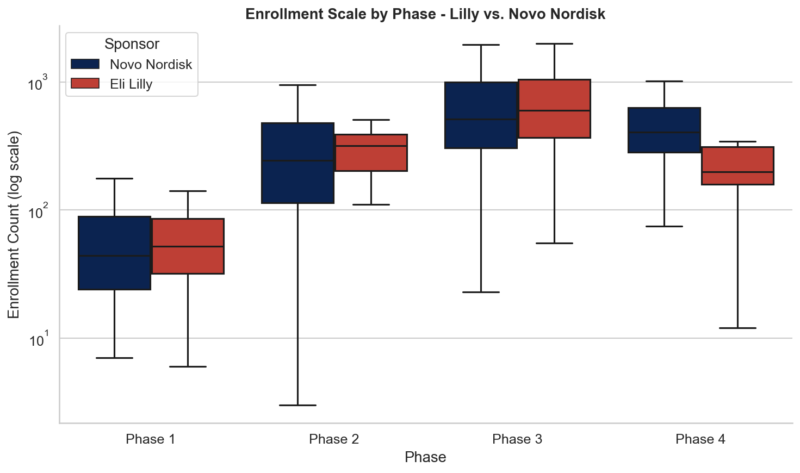 |
| 02 — Geographic Diversity | 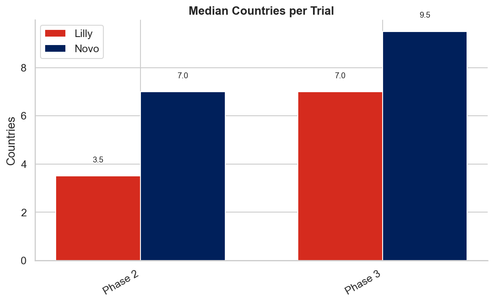 |
| 03 — Phase Distribution | 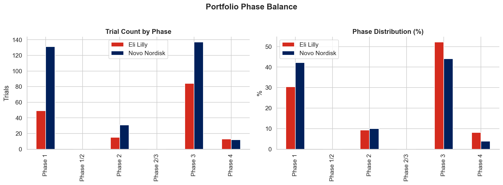 |
| 03 — Indication Breadth | 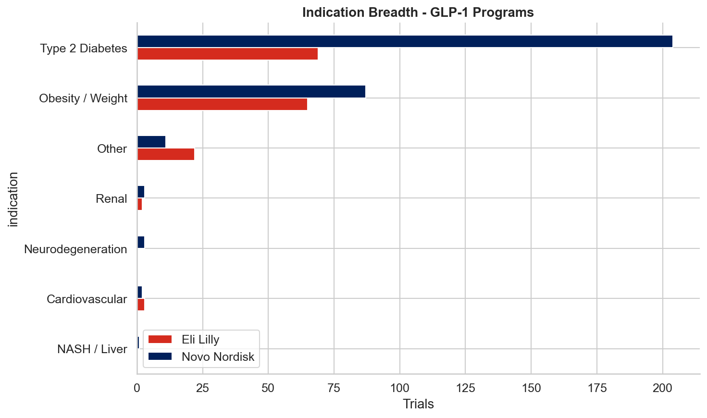 |
| 03 — Endpoint Classification | 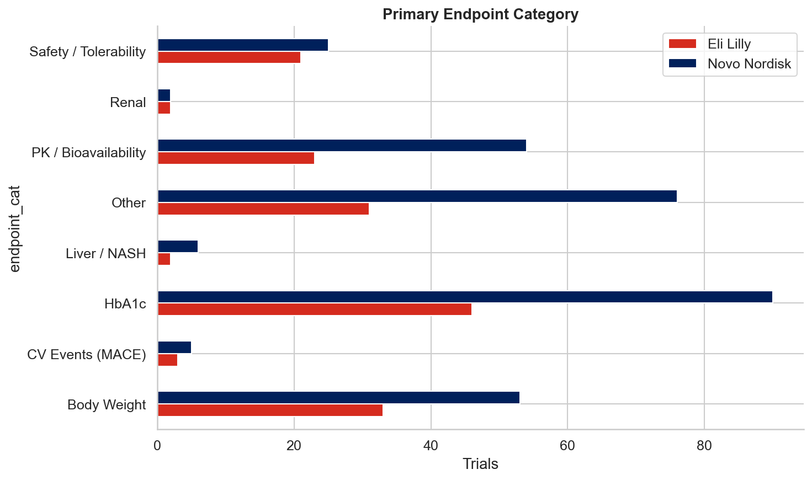 |
| 03 — Program Activity Trend | 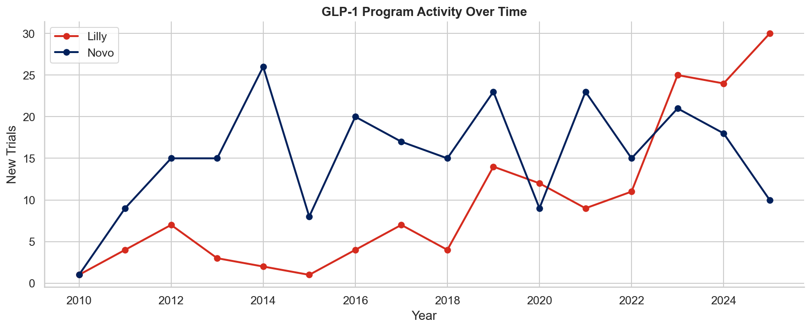 |
| 04 — Trial Status | 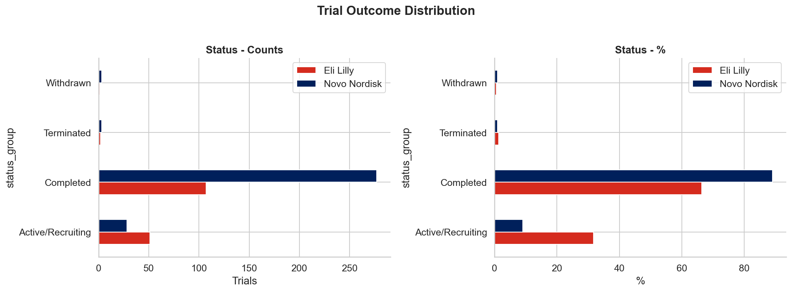 |
| 04 — Attrition Rate | 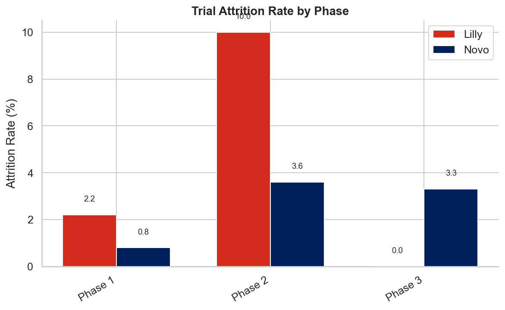 |
| 04 — Development Timeline | 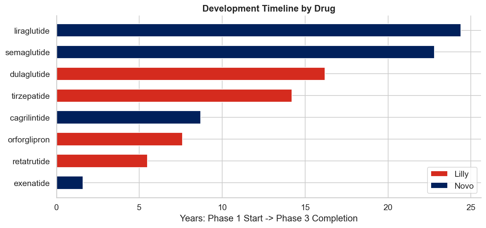 |
| 04 — Reporting Lag | 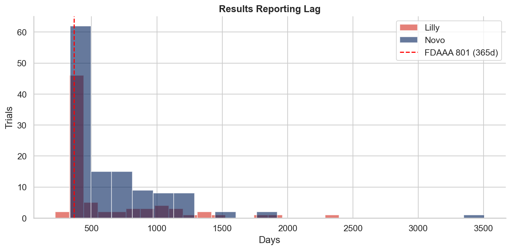 |
| 05 — Benchmarking Scorecard | 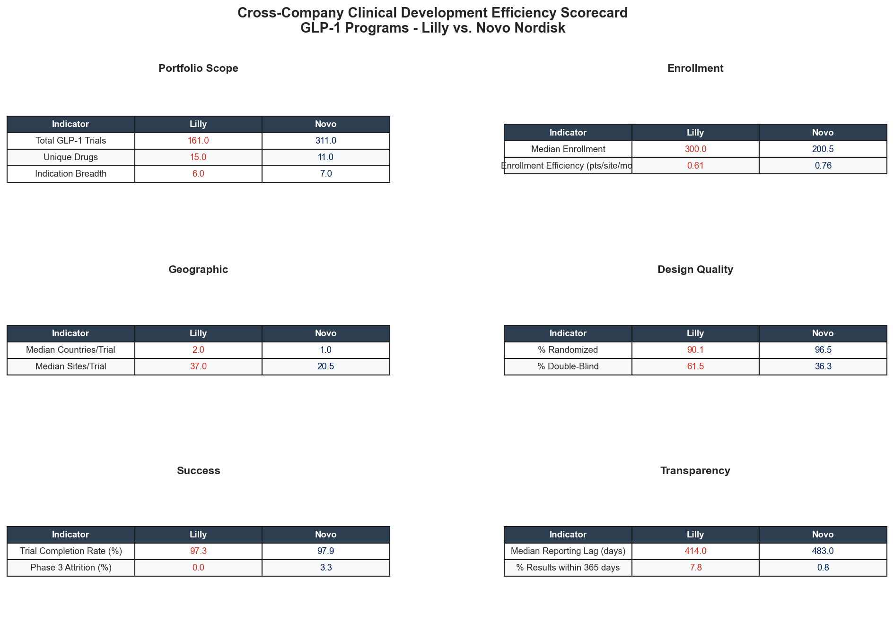 |
| 05 — Radar Comparison | 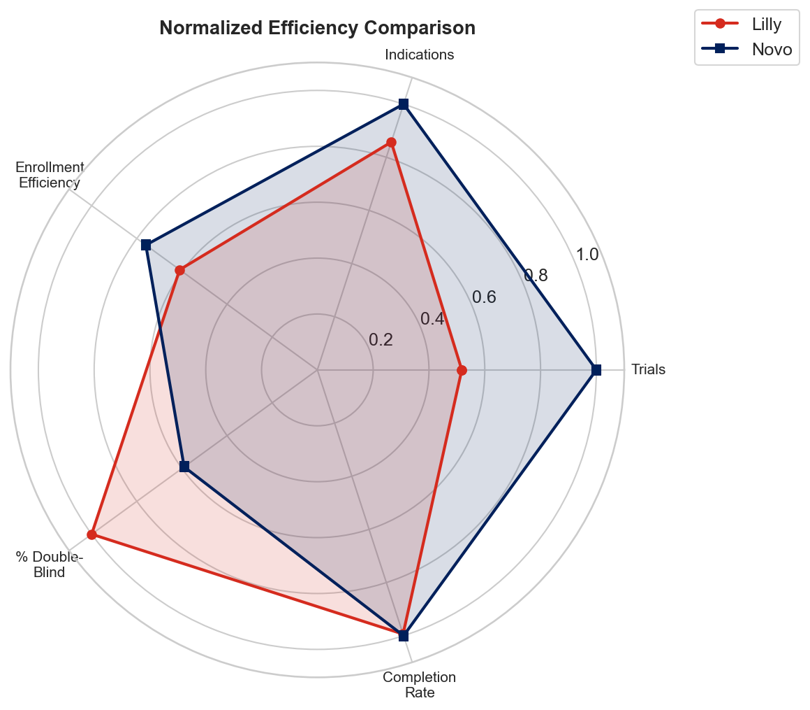 |

## Key Findings

| Indicator | Lilly | Novo |
|-----------|-------|------|
| Total GLP-1 Trials | 161 | 311 |
| Indication Breadth | 6 | 7 |
| Enrollment Efficiency (pts/site/mo) | 0.61 | 0.76 |
| Median Countries/Trial | 2.0 | 1.0 |
| Median Sites/Trial | 37.0 | 20.5 |
| % Randomized | 90.1% | 96.5% |
| % Double-Blind | 61.5% | 36.3% |
| Trial Completion Rate | 97.3% | 97.9% |
| Phase 3 Attrition | 0.0% | 3.3% |
| Median Reporting Lag (days) | 414 | 483 |
| % Results ≤ 365 days | 7.8% | 0.8% |

## Methodology Note

This framework is designed as a **replicable template**. The data collection pipeline, indicator definitions, and benchmarking logic are parameterized in `src/config.py` and can be applied to any therapeutic area or set of sponsors by modifying the configuration.

## Author

**Dr. Hanjing Wu**
Ph.D. in Bioengineering | M.S. Candidate in Computer Science, Syracuse University

📧 Email: hwu188@syr.edu
🌐 GitHub: [https://github.com/huansha2002](https://github.com/huansha2002)

---

## Repository Ownership and Use

This repository is maintained by Dr. Hanjing Wu for educational, research, and professional portfolio demonstration purposes.

Unauthorized reproduction or commercial use is prohibited.
